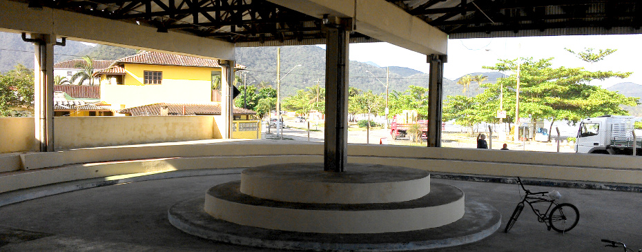

Ocupação Cultural do Perequê-Açu, encontro de encerramento do Festival Tropixel. Na sexta-feira, último dia do Festival, participantes de todos os módulos se reúnem para apresentar os projetos, oficinas e novas articulações que foram desenvolvidos ao longo da semana. A programação se encerra com apresentações artísticas multimídia a partir dos processos desenvolvidos durante o [Lab Experimental](../labxt).

O Terminal Turístico do Perequê-Açu é uma grande construção em frente ao mar, em um dos bairros de maior diversidade sociocultural de Ubatuba. Já teve diversos usos, mas por alguns anos foi praticamente abandonado. Recentemente, a Companhia de Turismo de Ubatuba começou a recuperar o espaço. O festival Tropixel decidiu fazer uma experiência, transformando o terminal em um grande centro cultural comunitário, pelo menos por um dia. Servirá como ensaio para futuros projetos de regeneração do espaço, e ainda como uma intervenção dentro de uma região importante da cidade, repleta de histórias, tensões e complexidades.

## Programação - 25/10 - a partir das 13h

### Laboratório de tecnologia

- MetaReciclagem
- Spirograph

### Sala de Projeção

- 18h Tão Longe é Aqui - Eliza Capai

### Palco aberto

- 13h Amar é cuidar do lixo
- 17h - Música orgânica - Percussão Corporal. Marcelo Machado.
- 16h30 - Tradição e contemporaneidade convivem - Cia. Teatral Os Abençoados por Cunhambebe

### Ônibus Hacker

### Labmóvel

### Feira de Artes e Cultura Abaetétuba

