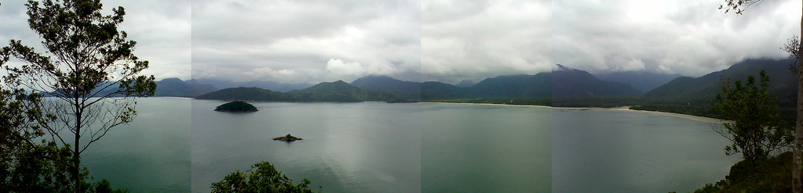

Programação pública do Festival Tropixel 2013 em Ubatuba. Todas as atividades são gratuitas. Acompanhe também pelo [Facebook](https://fb.com/tropixel.org) ou [Twitter](https://twitter.com/tropixelbr), e fique ligado no informe Tropixel que vai ao ar todas as manhãs de 21 a 25 de outubro na Gaivota FM (104.9 Mhz no centro de Ubatuba, ou em qualquer lugar do mundo pelo site).

1. Abertura - 21/10, Escola Técnica - Centro Paula Souza (prédio da Unitau).

- 13h30 Abertura da Semana Tecnológica da Etec. Álvaro Gonçalves (Etec) e Felipe Fonseca (Ubalab).
- 14h30 Painel Tecnologia feita à mão com Ricardo Brazileiro (3Eco), Julien Bellanger (PiNG, França), Jorge Crowe (Laboratorio de Juguete, Argentina) e outros.
- 16h30 Painel Pós-mídia e transformação social, com Clemens Apprich e Oliver Schultz (Post-Media Lab, Alemanha).
- 18h30 Recepção.
- 19h00 Abertura oficial com Felipe Fonseca (Ubalab), Raquel Rennó (PAEC/UFJF), Mikko Lipiäinen (Pixelache, Finlândia), Álvaro Gonçalves (ETEC - Centro Paula Souza), Maurício Moromizato (Prefeito de Ubatuba), Kailash Pinotti (Atmosfera Desenvolvimento Imobiliário) e Américo Córdula (SPC/Ministério da Cultura).
- 19h30 Painel Políticas Culturais e Transformação Social, com Américo Córdula e a participação remota de Célio Turino.

2. Seminário Sincronizando - 22/10, Escola Técnica - Centro Paula Souza (prédio da Unitau). [Saiba mais](../sincronizando).

-  13h30 Painel A Cidade como Laboratório Experimental com Felipe Fonseca (Ubalab), Fabricio Muriana (Arquitetura da Gentrificação) e Julien Bellanger (PiNG, França). Moderação Lula Fleischman (Nuvem).
- 14h30 Painel Lixo Eletrônico e Cultura do Conserto com James Wallbank (Access Space, Inglaterra) e Alex Garcia (Fab Social). Moderação Hernani Dimantas (Lixo Eletrônico).
- 16h Intervalo
- 16h30 Painel Bioarte com Tapio Mäkelä (M.A.R.I.N, Finlândia), Karla Brunet (Ecoarte/UFBA) e Maria Ptqk (Ptqk, Espanha). Moderação Raquel Rennó (PAEC/UFJF).
- 18h Intervalo
- 19h Painel Turismo Sustentável com Kelly Lima (ICEI Brasil), Nei (Secretaria de Turismo de Ubatuba) e Instituto Polis/Projeto Litoral Sustentável.
- 20h30 Planejamento Colaborativo da agenda do Lab Experimental.

3. O Lab Experimental Temporário (23 e 24/10) Veja a [programação detalhada](../labxt)

- Eteclab - Etec - Centro Paula Souza de Ubatuba - prédio da Unitau (22 a 25/10). Oficinas de tecnologias livres, installfest e demonstração de projetos;
- Quilombo da Fazenda - (23/10, 13h) reativação do Telecentro.br; debate Pé na Terra, Cabeça na Rede; oficinas de pesquisa e comunicação digital;
- ~~Quilombo do Cambury - (24/10, 13h) ~~- o telecentro não será inaugurado, porque a torre de energia caiu em decorrência das chuvas.
- Terminal Turístico do Perequê-Açu - (23/10 e 24/10, 13h) MetaReciclagem - Laboratório e oficinas de triagem e reutilização de resíduo eletrônico: esculturas, instrumentos musicais, redes autônomas. Montagem de telecentro com computadores usados. Presenças de Jorge Crowe (Laboratorio de Juguete), Julien Bellanger (Slowtech), Alex Garcia (Fab Social), entre outros;
- Hostel Vila Brasil (24/10, 19h) - lançamento da revista Facta, com Fred Paulino e Lucas Mafra (Gambiologia);
- Ônibus Hacker - Etec (23/10, 13h), Praça de Eventos de Ubatuba (24/10, 13h), Terminal Turístico do Perequê-Açu (25/10, 13h). Oficinas, debates e projetos experimentais;
- Labmóvel - Praça de Eventos (24/10, 13h), Terminal Turístico do Perequê-Açu (25/10). Debates e oficinas sobre mapeamento e cultura espacial;
- Oficinas, intervenções, trabalho de campo, mapeamento de ciclovias e outras atividades nas ruas e bairros da cidade.

4. Fórum Ubatuba - Um Futuro para Todos.

- Programação em parceria com a Prefeitura Municipal de Ubatuba, debatendo planos e projetos de tecnologia para a cidade. Com Maurício Moromizato (Prefeito de Ubatuba), Felipe Fonseca (Ubalab), Álvaro Gonçalves (ETEC - Centro Paula Souza), Pedro Seno (Assessoria de TI da Prefeitura), Cândido Moura (Coordenador do Projeto UbatubaSat).

5. OCUPA. (25/10) - Ocupação Cultural do Perequê-Açu, encontro de encerramento do Festival Tropixel. [Saiba mais](../ocupa).

- 14h às 20h. Programação definida colaborativamente: Palco aberto, Espaço de projeção, Feira de Artes e Cultura, Exposição, Telecentro e Vão livre.

O Festival terá cobertura em tempo real pela internet (twitter e facebook). Algumas partes da programação serão transmitidas ao vivo pela internet. Todas as manhãs entre os dias 21 e 25 de outubro, a Rádio Comunitária Gaivota FM recebe convidados do festival entre 10h e 11h para contarem o que vêm fazer em Ubatuba (o programa poderá ser ouvido ao vivo pela frequência 104.9 Mhz no centro de Ubatuba, e no mundo inteiro pela internet). O Festival será também amplamente documentado em fotografias, vídeo e áudio.

## Mais sobre a cidade

Ubatuba, localizada no litoral norte do estado de São Paulo, é uma cidade de grande diversidade cultural, social e religiosa. À importância das comunidades tradicionais - caiçaras, quilombolas e indígenas - somam-se correntes migratórias de diversas épocas e origens, intelectuais e artistas radicados, empresários em busca de qualidade de vida, profissionais autônomos em rota de fuga das cidades grandes. Tem um inestimável patrimônio natural, com a maior cobertura proporcional de mata atlântica do Estado, e mais de quatro séculos de história.

Uma grande proporção da população utiliza bicicletas como meio de transporte cotidiano. A cidade conta com cerca de uma centena de fantásticas praias, além de uma imensa biodiversidade. A sociedade civil participa ativamente da discussão sobre o estado atual e da elaboração de planos participativos para o futuro.

Uma leitura otimista aponta para um futuro promissor, com alta qualidade de vida, justiça social e sustentabilidade. Entretanto, algumas questões importantes exigem atenção. Entre elas a alta evasão de talentos devido à falta de alternativas após a conclusão do ensino médio; a baixa auto-estima sentida por todos os estratos da população; a distribuição desigual dos resultados da exploração comercial de suas atrações turísticas e naturais; e a relação problemática da sociedade com seu território, pela falta de mecanismos claros de regulação e conciliação entre usos tradicionais de recursos naturais e preservação ambiental. Uma questão particularmente complexa é a gestão do lixo, que precisa ser exportado, percorrendo mais de 160km de estrada.

Em tal cenário, mais importante do que aplicar uma cartilha pronta de soluções é imaginar futuros diferentes. Igualmente prioritário é identificar, valorizar e apoiar talentos locais, promovendo seu pleno desenvolvimento a partir do intercâmbio e do aprofundamento conceitual e técnico. A proposta do Festival Tropixel em Ubatuba, articulado pelo núcleo Ubalab em parceria com uma comissão organizadora com abrangência nacional, é atuar nesta encruzilhada, proporcionando um intenso processo de troca e construção colaborativa entre iniciativas locais e propostas de diferentes lugares do Brasil e do mundo.

## Recomendações

Traga repelente, protetor solar, guarda-chuva, óculos de sol.