Durante a primeira semana de junho de 2015, Ubatuba, cidade localizada no litoral norte de São Paulo, foi cenário da realização do Tropixel Ciência Aberta. O evento foi composto por oficinas, apresentações e debates, além de um laboratório experimental de tecnologias abertas para produção de conhecimento e soluções para questões de desenvolvimento local. Cerca de cem pessoas participaram do evento, que reuniu convidados da própria cidade, de outras regiões do Brasil e também de outros países.

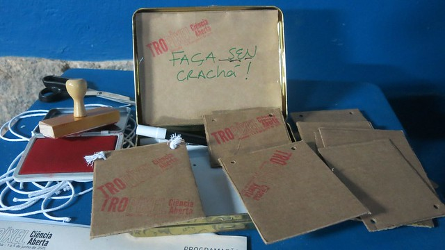

Tropixel é uma rede brasileira que desenvolve eventos em formatos dinâmicos, buscando a conjunção entre arte, ciência, tecnologia e sociedade. Em anos anteriores havia organizado o Festival Tropixel em Juiz de Fora e em Ubatuba, e o Ensaio Tropixel #1 em Ubatuba. É associada à rede Pixelache, criada na Finlândia no início da década passada e responsável pela produção de dezenas de eventos e projetos de arte e ciência em países de três continentes.

A edição de junho, batizada de Tropixel Ciência Aberta, foi concebida em parceria entre a rede Tropixel e a plataforma Ciência Aberta Ubatuba, com o intuito de promover o diálogo entre as diversas instituições, grupos e indivíduos envolvidos com a produção e difusão de conhecimento em Ubatuba e região. O principal objetivo foi propor a reflexão e a troca de experiências sobre o papel da adoção de práticas abertas e colaborativas por projetos científicos, além de dar visibilidade a iniciativas da região que já adotam práticas da ciência aberta. O evento visou ainda trocar experiências sobre soluções com ferramentas abertas e metodologias colaborativas para projetos de interesse local.

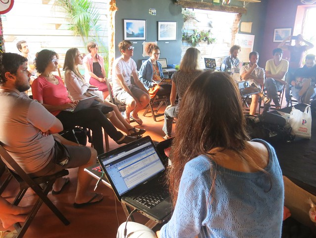

A programação incluiu dois dias de oficinas de hardware científico aberto na Etec - Centro Paula Souza de Ubatuba; um painel de apresentações e debates sobre experiências de ciência aberta com duração de uma tarde no auditório do Aquário de Ubatuba; e por fim dois dias de um laboratório experimental #mozsprint, conectado ao Mozilla Science Global Sprint, acontecendo no Jardim Cultural.

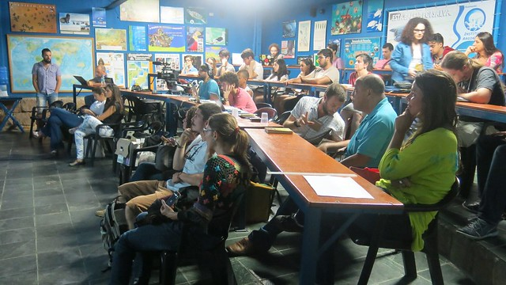

O Tropixel Ciência Aberta foi parte da programação da sexta edição do Festival da Mata Atlântica - Floresta, Rios e Mar. Contou com apoio institucional do IBICT, do IDRC e da OCSDNet, além da Prefeitura Municipal de Ubatuba, do Ubalab, da Rede Infoamazônia, do Pimentalab, do Liinc/IBICT-UFRJ e do Ecotrip Hostel.

## Oficina Hardware Científico Aberto

Nos dias 1 e 2 de junho, o Tropixel Ciência Aberta recebeu uma oficina de Guima-san e Gina Leite, da Rede Infoamazônia. Trata-se de um projeto que foi finalista do Desafio Google de Impacto Social e está desenvolvendo uma rede de sensores de qualidade da água em Santarém, no coração da Amazônia. Os integrantes da equipe contaram sobre o histórico do projeto, a atuação do projeto Infoamazônia gerando e relacionando dados que servem de base para a criação de conteúdo jornalístico e informativo. Mostraram diversos tipos de sensores, desde aqueles produzidos comercialmente até outros fabricados artesanalmente. Trouxeram ainda um protótipo avançado do equipamento que irão produzir para o projeto, chamado de Mãe d'Água, que conecta vários tipos de sensores para compor um retrato da qualidade da água.

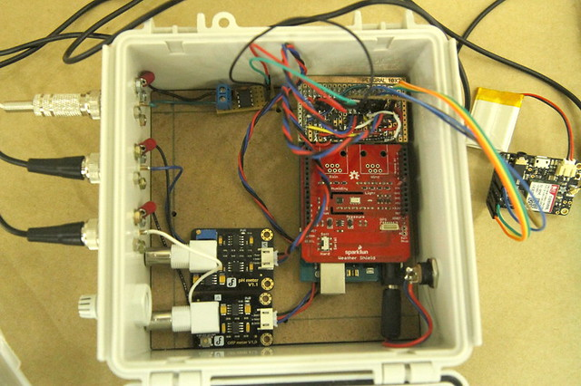

Ao longo dos dois dias, os participantes - grande parte deles estudantes de ensino técnico - tiveram a oportunidade de desenvolver seus próprios sensores simples de condutividade elétrica, utilizando componentes acessíveis e de baixo custo com base em um projeto do Public Lab. A plataforma Ciência Aberta Ubatuba também aproveitou para fazer uma pequena pesquisa sobre o perfil dos participantes, cujos resultados serão publicados nos próximos dias.

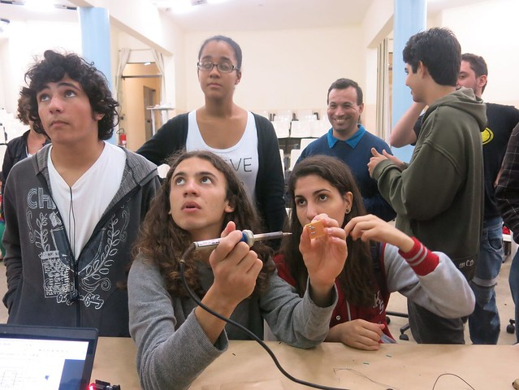

## Painel Ciência Aberta

Na quarta-feira, dia 3 de junho, o evento migrou para o auditório do Aquário de Ubatuba, onde aconteceu o painel sobre temas relacionados ao universo da ciência aberta e colaborativa, com foco especial na sua relação com o desenvolvimento da cidade e região. O painel foi organizado, em duas sessões, com a intenção de aproximar pesquisadores e instituições que já trabalham com perspectivas próximas à ciência aberta, além de trazer referências relevantes de outras partes do Brasil e do mundo.

A abertura foi feita por Felipe Fonseca, coordenador local do evento, seguido da apresentação remota de Leslie Chan (Universidade de Toronto) sobre os objetivos da rede internacional OCSDNet, da qual faz parte a Plataforma Ciência Aberta Ubatuba.

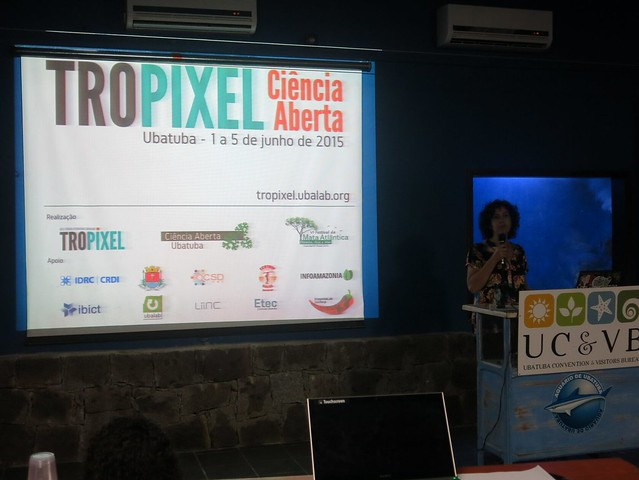

A primeira mesa, coordenada por Sarita Albagli (IBICT), teve por tema "Territórios e Conhecimento" e contou com falas de Diogo Soares (Litoral Sustentável); Maira Begalli (UFABC); Thereza Dantas, Marcela e Eduardo (Fórum de Comunidades Tradicionais); Álvaro Fazenda (Forest Watchers) e Eliane Simões (Redelitoral). Gestão e construção participativas, cartografias coletivas e conhecimentos tradicionais foram temas bastante presentes.

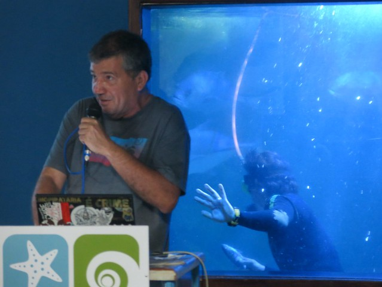

Com o tema "Fronteiras abertas", a segunda sessão, coordenada por Henrique Parra (Unifesp) trouxe as experiências de Cândido Moura (Ubatubasat); Rachel Jacobs (Active Ingredient); Jorge Machado (Colab/USP); Juliana Bussolotti (Associação Cunhambebe); Guima-san (Infoamazônia) e Luciana Fleischman (Tropixel). Os vídeos das apresentações estão disponíveis na página wiki do evento.

## Laboratório #mozsprint

Os dois últimos dias do Tropixel Ciência Aberta tinham a proposta de abrir espaço para a troca de experiências e a realização de atividades de desenvolvimento e aplicação de ferramentas de conhecimento aberto. O lab esteve conectado a dezenas de iniciativas ocorrendo simultaneamente em diversas partes do mundo, compondoo Mozilla Science Global Sprint. Este é um evento internacional e em tempo real voltado ao desenvolvimento de projetos de ciência aberta, organizado periodicamente pela Fundação Mozilla.

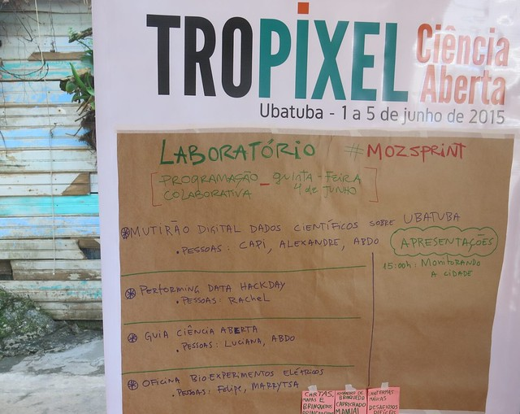

Em Ubatuba, o lab teve diversos eixos de atuação:

* levantamento de dados científicos sobre Ubatuba em sistemas e acervos disponíveis na internet, mobilizado por Capi Etheriel (Transparência Hacker) e André Appel (Liinc/IBICT-UFRJ);
* "hackeamento" dos equipamentos e sensores trazidos pela artista britânica Rachel Jacobs, que fazem parte da obra Prediction Machine, e a exploração de pontos de contato com as pesquisas de Guima-san para o Infoamazônia e outros projetos. Participaram também Leandro Ramalho e outros integrantes do Arduino Ubatuba, além de membros do Estúdio Avante;
* entrevistas em vídeo sobre temas ligados à ciência aberta com convidados do evento, capitaneadas por Henrique Parra (Unifesp), Sarita Albagli (IBICT) e Juliana Andrade (Pimentalab);
* oficinas de bioexperimentos elétricos, que utilizaram legumes e outros vegetais como fonte de energia, propostas por Filipe Machado e Marrytsa Melo;
* edição colaborativa de Guias para Ciência Aberta, coordenada por Luciana Fleischman (Tropixel), Alexandre Abdo (OKBr) e Sarita Albagli (IBICT);
* oficina de geoprocessamento utilizando o software livre qgis, oferecida pelos estudantes de gestão territorial da UFABC, sob coordenação de Maira Begalli;
* apresentação, por Jutta Machado (Colab), de aplicativo de pesquisa de opinião de base comunitária, para empoderamento local e subsídio a políticas públicas, desenvolvido pelo MIT;
* sessão de brainstorm e construção coletiva a partir de questões trazidas por Felipe Spina (Mosaico Bocaina), para desenvolvimento de ferramentas de produção participativa e comunitária de informações de monitoramento e alerta ambiental.

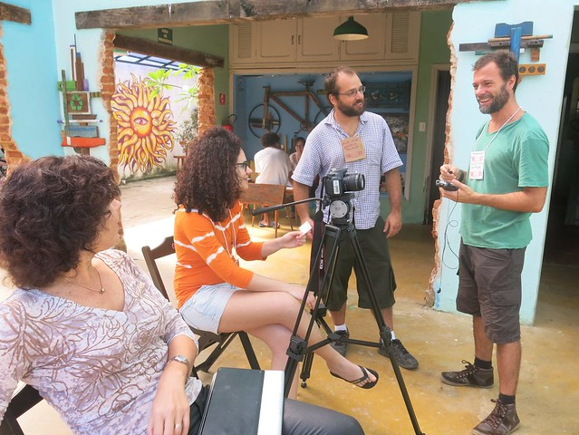

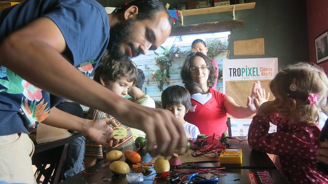

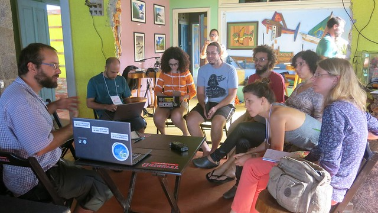

Ao fim da sexta-feira, dia 5 de junho, os participantes do lab reuniram-se de frente para o mar para uma última rodada de conversas. Ficou no ar o desejo de levar em frente as ideias e explorações iniciadas durante os dias do evento.

## Documentação

Um dos elementos mais importantes em qualquer projeto de ciência aberta é o compartilhamento de dados. Tendo isso em vista, foi solicitado aos participantes do Tropixel Ciência Aberta que publicassem o material que trouxeram ou geraram durante os dias do evento. Esta lista ainda será ampliada e publicada na nossa [página wiki](https://pt.wikiversity.org/wiki/Pesquisa:Ci%C3%AAncia_Aberta_Ubatuba/Tropixel_Ci%C3%AAncia_Aberta), mas por enquanto já temos os seguintes recursos disponíveis:

- Uma [coleção de imagens](https://www.flickr.com/photos/felipefonseca/albums/72157654730781695/);
- Uma lista com [vídeos das apresentações](https://www.youtube.com/playlist?list=PL4qxxbzI7iyRr_wvo1GK-AgEpCSz8JsdE) do Painel Ciência Aberta;
- Um pad (página web editável) com links e relatos enviados por participantes.

