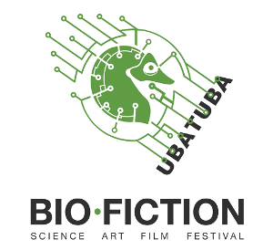

A mostra de vídeos [Bio-fiction](https://bio-fiction.com/) explora o campo emergente da biologia sintética a partir de diferentes perspectivas disciplinares incluindo a ciência e engenharia, os estudos culturais, a biologia amadora, e os campos de videomakers, artistas e designers.

Organização da mostra em Ubatuba: Karla Brunet (UFBA).

Primeira parte: Durante a [Abertura Tropixel Labs](../abertura).

22/10, 19h, n'o Jardim Cultural (Rua Guarani, 345, Itaguá). Seguido de debate sobre Bioficcão com Karla Brunet e Laia Barres.

    Reinventing the Dodo

    Copy & Clone

    Living Food Eugene

    Bioluminiscent Streetlamps

    Hybris

    New Mumbai

    Exploring indonesia

Segunda parte: após a Jornada Outros Desenvolvimentos.

23/10, 19h, no Auditório da Etec/Unitau (Av. Castro Alves, 392, Itaguá)

    Zero Park

    Synbio Ads London

    I Wanna Deliver a Dolphin

    Bio Flaneur

    Bacteria to the Future

    East End Journey

    Puppet Earth

    The Arsehole Gene
