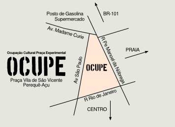

Ocupação Cultural Praça Experimental

Sábado, 24/10/2015 - Praça Vila de São Vicente (Perequê-Açu)

Para marcar o último dia de atividades gratuitas e abertas ao grande público (24/10), estamos organizando a OCUPE - Ocupação Cultural Praça Experimental, que promoverá o diálogo entre cultura, ciência e espaço público. Trata-se de uma proposta de intervenção urbana através da qual a praça Vila de São Vicente (mapa), no Perequê-Açu, será transformada por um dia em espaço multifacetado dedicado à arte, à educação, à experimentação e à convivência social.

OCUPE conta com apoio da Fundart, Espaço Convívio das Artes, Kantuck, Espaço Antera, Lab Experimental e Gaivota FM.
Preparativos e recomendações

Vamos para a praça! Começaremos por volta das 14h. Preste atenção na lista do que recomendamos levar:

    Cangas
    Cadeiras de praia
    Guarda-chuvas
    Guarda-sois
    Lonas
    Cordas
    Repelente
    Violões
    Tambores
    Brinquedos
    Alimentos

Teremos uma mesa coletiva de piquenique. A ideia é compartilhar: traga comidinhas para doar ao coletivo (de preferência saudáveis e frescas). Queremos também promover uma gincana colaborativa, percorrendo os estabelecimentos da região, falando sobre o evento e arrecadando mais produtos para a mesa.

Se chover, vamos mostrar que não somos de açúcar! Mas para facilitar um pouco e proteger equipamentos, contamos com o generoso apoio do Espaço Convívio das Artes, que fica em frente à praça. Caso não seja possível realizar atividades na praça, algumas delas serão movidas para dentro do espaço - em especial as oficinas, debates e sessões de vídeo.

Pretendemos encerrar as atividades entre 21h e 22h. Para isso acontecer, precisamos começar um esforço de organização, fechamento e limpeza da praça a partir das 20h.
 
Planos para o dia

Todos os planos abaixo podem e serão modificados durante a ocupação. Procure o mural da praça para consultar o mapa de espaços e a agenda corrente de atividades.
Agendados

    14h Arduinoise - Criação de instrumentos musicais com Arduino e eletrônicos acessíveis, com Caleb Mascarenhas
    14h-16h Oficina [Inspirador](http://www.goethe.de/ins/br/lp/pro/Inspirador.pdf): dá pra fazer produção cultural de outro jeito - INSCREVA-SE para garantir sua vaga (são somente vinte)
    16h Debate espaço público
        Arte Bicicleta Mobilidade - Fabs Balvedi (PR)
        Tropixel OCUPE - Felipe Fonseca
    17h-19h Oficina mapeamento afetivo, com Jonaya Castro
    18h00 Apresentação Grito de Maria
    19h00 Flamenco
    19h30 Mostra vídeos organizada por Karla Brunet
    20h30 Encontro Marcado - Kantuck

Continuados/ideias soltas

    Lambe OCUPE nos postes do entorno da praça (FF leva impressora)
    Oficina [Spirograffe](https://fablabo.net/wiki/Spirogaffe) com Julien Bellanger
    Modificações na infraestrutura da praça:
        Acesso a carrinhos/cadeirantes
        Jogo de amarelinha
        Refazer a placa da praça
        Bancos de praça - como melhorar?
    Intervenções sustentáveis
        Brinquedos/playground para crianças
        Oficina de agricultura urbana
            Plantio de árvores frutíferas e nativas (e citronela ;)
            Oficina de bombas de sementes
    Mural da praça

Configurada como laboratório experimental participativo, OCUPE sediará oficinas, apresentações, debates, mostras e intervenções selecionadas através de convocatória aberta. Vai refletir o tema “outros desenvolvimentos”, temática geral desta edição do Festival Tropixel. Insere-se em um histórico ímpar de ocupações culturais do espaço público em Ubatuba, e pretende estabelecer tanto uma estratégia descentralizada de intervenções artístico-científicas em outras praças da cidade quanto um plano de ocupação periódica da praça como espaço cultural e coletivo.

A proposta de OCUPE retoma as atividades do primeiro Festival Tropixel, realizado em 2013, quando ação semelhante foi desenvolvida no Terminal Turístico do Perequê-Açu, que foi convertido em centro cultural durante um dia.
Convocatória

OCUPE recebeu propostas de participação através de uma convocatória pela internet. O rascunho da programação final está na wiki.
